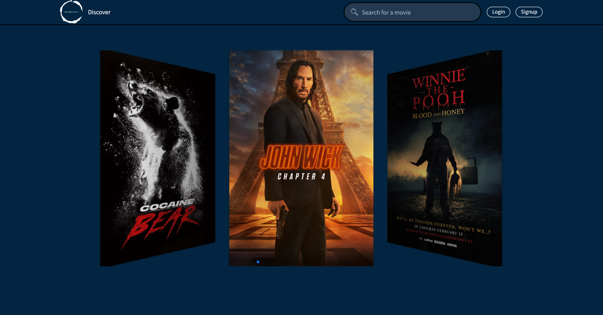

# Entertainment Center



## Main information

Fullstack MERN (MongoDB for database, Express and Node for backend, and React for frontend) Movie database application which allows users performing CRUD operations :

-   Create an account
-   Search for movies
-   Save the movie to a watchlist or already watched
-   Rate the movies

What is the MERN stack?

MERN stack is a web development framework. It consists of MongoDB, ExpressJS, ReactJS, and NodeJS as its working components. Here are the details of what each of these components is used for in developing a web application when using MERN stack:

-   MongoDB — a document-oriented, No-SQL database used to store the application data.
-   Express(.js) — a framework layered on top of NodeJS, used to build the backend of a site using NodeJS functions and structures.
-   React(.js) — a client-side JavaScript framework. It is a library created by Facebook and it's used to build UI components that create the user interface of the single page web application.
-   Node(.js) — is a single-threaded, open-source, cross-platform runtime environment for building fast and scalable server-side and networking applications.

The project goal:

-   Backend features:

    -   initialize backend using npm and install necessary packages
    -   set up a MongoDB database
    -   set up server using Node.js and Express.js
    -   set up API routes to create, read, update and delete documents from the database
    -   set up controller functions for API routes
    -   Setup user authentication an encryption
    -   testing API using Postman

-   Frontend features:
    -   initialize the 'create-react-app frontend'
    -   install 'axios' and use it to send a GET request to the backend to fetch the data
    -   use useState and useEffect React Hooks to manipulaite with data
    -   create React components in App.js
    -   styling app with Styled Components

## Prerequesits

-   Backend:

    -   Node 18
    -   Express 4.18.1
    -   Axios 0.27.2
    -   Bcryptjs 2.4.3
    -   joi 17.6.0
    -   jsonwebtoken 8.5.1
    -   uuid 8.3.2

-   Frontend:
    -   Reacy 18.2.0
    -   Axios 1.3.4
    -   Styled Components 5.3.9

## Client side usage

-   Create a **.env** file in the client directory
-   Create a **REACT_APP_SERVER_URL** variable and assign it the **backend ip**

```bash
	$ cd client
    $ npm i
    $ npm start

```

## Server side usage

-   Create a **.env** file in the server directory
-   Create the following variables
    -   `Port`
    -   `API_KEY`
    -   `MOVIE_BASE_URL=https://api.themoviedb.org/3/`
    -   `POSTER_BASE_URL=https://image.tmdb.org/t/p/original`
    -   `MONGO_URI`
    -   `JWT_SECRET`
    -   `SALT`

```bash
	$ cd client
    $ npm i
    $ npm start

```

## Useful links

### MERN Stack Explained

```
https://www.mongodb.com/mern-stack
```

### MongoDB Basics

```
https://www.mongodb.com/basics?
```

### About Node.js

```
https://nodejs.org/en/about/
```

### Express.js guide

```
https://expressjs.com/en/guide/routing.html
```

## ⚡ Built With

[MongoDB](https://www.mongodb.com/) | [Express.js](https://expressjs.com/) | [React](https://reactjs.org/)
| [Node.js](https://nodejs.org/en/)
